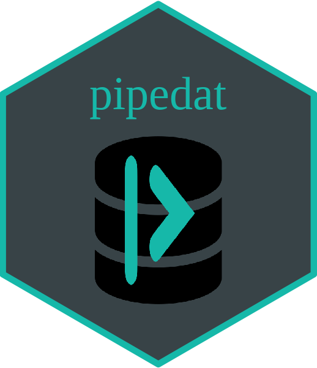

<!-- README.md is generated from README.Rmd. Please edit that file -->

```{r, include = FALSE}
knitr::opts_chunk$set(
  collapse = TRUE,
  comment = "#>",
  fig.path = "man/figures/README-",
  out.width = "100%"
)
```

# pipedat <a href='https://github.com/Ecosystem-Assessments/pipedat'></a>

<!-- badges: start -->
<!-- [](https://github.com/inSileco/graphicsutils/actions/workflows/check-moreorless-standard.yaml) -->
<!-- [](https://codecov.io/gh/inSileco/graphicsutils) -->
[](https://www.tidyverse.org/lifecycle/#preliminary)

[](https://github.com/Ecosystem-Assessments/pipedat/actions/workflows/R-CMD-check.yaml)
<!-- badges: end -->

*pipedat* is a R package that provides analytical pipelines to access, load, and format a variety of data from multiple sources programatically. The goal of *pipedat* is to enhance the capacity scientists, planners and the wider public to prepare and perform complex and reproducible ecosystem-scale assessments requiring the integration of multiple spatial datasets such as cumulative effects assessments in the context of ecosystem-based management, and Marxan analyses for the establishment of individual and networks of MPAs. In its current format, *pipedat* is strictly experimental and in development. We are however hoping to further develop this initiative in the hopes of greatly enhancing the efficiency, transparency and reproducibility of large-scale environmental assessments. 

WARNING: This version of the package is deprecated and kept for reproducibility purposes for the [`nceadfo`]() project, which heavily relies in the `pipedat` package. The `pipedat` package was begun in the wake of the `nceadfo` project; with `nceadfo` complete, I regrouped and thought of ways to make `pipedat` better and simpler to use. 

Since `pipedat` is actively developed and structured as part of other ongoing projects, it is likely that other partial versions like this will be created and kept as individual branches unless the projects themselves are updated to work with the latest version of the `pipedat` package. 

## Installation

The easiest way to install `pipedat` is to use [`remotes`](https://cran.r-project.org/package=remotes):

``` r
install.packages("remotes")
remotes::install_github("Ecosystem-Assessments/pipedat")
```

Then, load it:

```r
library(pipedat)
```

## Main features 

The `pipedat` package is built around function called `pipedat()` that is used to access, load and format a wide variety of data; this function calls on a series of individual scripts built to access data programmatically and reproducibly, which we refer to as *data pipelines*. Individual data pipelines are executed by using their *unique identifier*, which are specific to the `pipedat` package. By default, the `pipedat()` function will export the raw and formatted data in folders 'data/data-raw/' and `data/data-format`, respectively. 

## List of pipelines 

```{r echo = FALSE}
pipedat::pipelist("data")
```

## How to contribute

External contributors are welcome to contribute data pipelines to this package. Simply fork the [public repo]() and create your own data pipeline. The `pipenew()` function creates a `dp_#####.R` template for you to use to create a new data pipeline with a unique id. Create a pull request for us to review the data pipeline for inclusion in the package. 

A single pull request per pipeline should be created, and merged pull requests should be squashed into a single commit.
